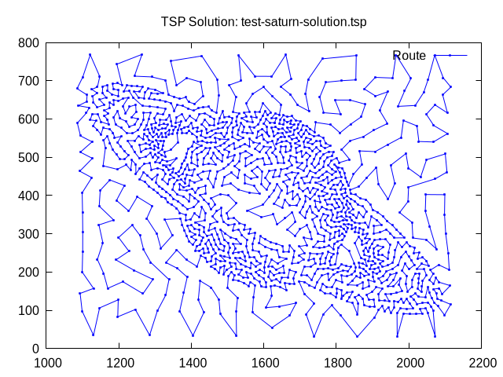

# pecc
Parallel Evolutinary Computing in C

## Memetic Algorithm for Euclidean TSP
The implementation presented encodes the solutions as
permutations and uses the following operators:

- Random Selection
- Order Crossover (OX1)
- Swap Mutation
- Local search with 2-opt neighborhood - First improvement
- Full generational replacement with elitism - The best individual is
always kept in the population.

All the source code is in the `src/` directory.

### How to use
Make sure to have installed the `clang` C compiler and `OpenMP`.

Compile using:

```bash
make
```

Clean all binaries using

```bash
make clean
```

Execute the memetic algorithm with the following command

```bash
./bin/pecc memetic_euc_tsp test_inputs/best_input_for_saturn.txt
```

Where the first argument is the algorithm to be used and the second
argument is a file with all arguments necesary for program to run properly.

Then depending on the output files you can plot the solutions, and a performance
graph of the algorithm.


```bash
./plot_tsp_solution.sh results/test-saturn-solution.tsp
```

```bash
./plot_performance.sh results/test-saturn-solution.tsp
```

### Saturn




### pr152


### ch130 


### berlin52


